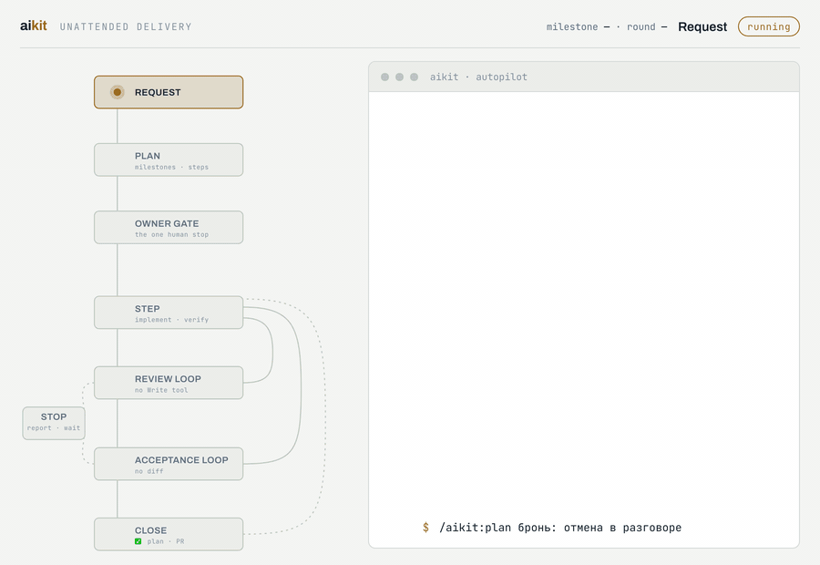

# aikit

A delivery pipeline for [Claude Code](https://claude.com/claude-code) that can
run without someone watching it.

Plan the work into numbered milestones. Take each step through a reviewer that
**cannot edit code**. Take each finished milestone through an acceptance agent
that **never sees the diff**. Nothing passes on the author's own word.

<picture>
  <source media="(prefers-color-scheme: dark)" srcset="docs/pipeline-dark.gif">
  
</picture>

Round one fails in both loops above, on purpose — the loop is the product, and a
clean straight-through run would show you the opposite of what this does.
[**Watch it interactively →**](https://claude.ai/code/artifact/00501ab2-7b5e-470b-b5bf-8a71054e279c)
· regenerate the GIF with `node docs/capture.mjs dark out/frames` (see
[`docs/capture.mjs`](docs/capture.mjs)).

## Why it exists

A test suite checks what the author foresaw. That is a real limit, not a
staffing problem — which is why the findings that matter keep arriving through
the owner's own eyes while the suite is green. Adding more tests does not fix
it. What is missing is a **layer of judgement**: someone who uses the thing and
says whether a person could.

aikit adds two such layers, and both work the same way — by taking something
away rather than by asking nicely:

| | how it is independent |
|---|---|
| `reviewer-strict` | has no `Write` or `Edit` tool at all — it *cannot* patch what it reviews |
| `acceptance` | its brief contains no file names — looking for the code destroys the only check it exists for |
| the gate (`bin/verdict`) | a program, not a paragraph: an incomplete report exits non-zero exactly like a breakage |

A rule enforced by an instruction holds until the first long run. A rule
enforced by a missing tool holds always.

## Install

```
/plugin marketplace add earlzdev/aikit
/plugin install aikit
```

Then, in a project:

```
/aikit:init
```

It reads the repo, asks only what it cannot infer, writes one `aikit.yml`, and
**proves the pieces run** rather than declaring success.

## Use

```
/aikit:plan  <what to build>     # milestones, each with its own "done when"
/aikit:autopilot                 # run the pipeline until done or genuinely blocked
```

or a single piece on its own — each skill is invocable by name:

```
/aikit:review-loop <task>        # do it, then loop an independent reviewer
/aikit:acceptance-loop <n>       # walk a finished milestone by hand
```

## One config, not copied templates

Everything project-specific lives in one `aikit.yml` at the repo root, read at
**runtime**:

```yaml
zones:
  - key: backend
    paths: ["src/**"]
    verify: "pytest -q"
verify_all: "ruff check . && pytest -q"
review:
  rounds: { develop: 3, fix: 2 }
```

This is the design decision the whole plugin turns on. aikit's predecessor
substituted values into copied template files at scaffold time — which works
exactly once. Two projects built that way ended up five versions behind with no
upgrade path, because a rendered copy can only ever be re-rendered over the
owner's own edits. Reading the values at runtime means upgrading aikit changes
nothing in the project.

Full reference: [`docs/config.md`](docs/config.md). Worked examples:
[`docs/examples/`](docs/examples/).

## What ships

```
skills/     init · plan · review-loop · acceptance-loop · autopilot
agents/     reviewer-strict · acceptance
bin/        verdict (the gate) · drive (browser hands)
```

`bin/verdict` is dependency-free Python and unit-tested — it is the piece that
decides whether a milestone may merge, so it is the piece that has to be right:

```
python3 -m unittest discover -s tests
```

## What your project supplies

Two commands, and only if you want the acceptance phase at all. Leave the
`acceptance` block out of `aikit.yml` and the phase does not exist — the right
configuration for anything with no interface to walk.

- **a disposable stand** (`up` / `down`) — never production, torn down with its
  volumes;
- **a read-only query** — one `SELECT`, under a database role with no write
  privilege. Read-only as a property of the role, not as an instruction: an
  agent that *can* fix the stand to match its expectation eventually will.

Contract and worked example: [`docs/harness.md`](docs/harness.md).

Hands are optional — `bin/drive` attaches to a Chromium over CDP and gives the
agent an accessibility tree plus a screenshot after each action, enforcing the
action and time budgets itself. Point `acceptance.hands` at your own driver when
the browser is only reachable from inside a container — or at MCP tools, for a
stack that is not a browser at all. The agent holds every tool the project has;
`hands` and `truth` only tell it which ones reach this product.

## Status

`0.2.2`. Verified against a real project, not only in unit tests:

- **`bin/verdict`** — 61 unit tests, plus an end-to-end pass in a scratch git
  repo covering all fifteen gate paths: blocking findings, every report defect,
  the owner override, `--no-db`, and the working-tree tripwire — including that
  a gitignored evidence directory does *not* trip it, that a test suite writing
  bytecode does not either, and that a real source edit does.
- **`bin/drive`** — driven against a live headless Chromium: opens a page,
  reads back an accessibility tree, types and clicks by role, and refuses once
  the action budget is spent.
- **The skills and agents** are written procedure, not code. `reviewer-strict`
  has been run on a real diff; the rest is exercised by using it.

Two guarantees are hard — the reviewer has no editing tool in its process, and
the gate's exit code is a number. Everything else is procedure a model follows.

## Licence

MIT.
